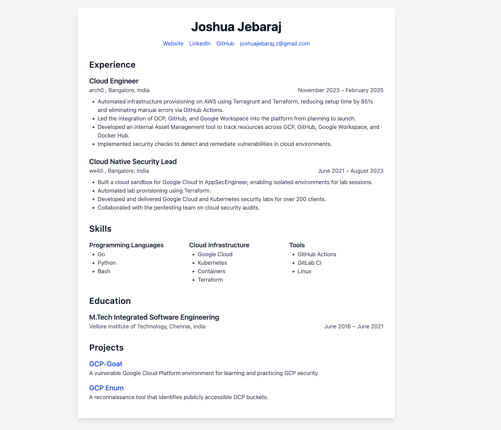

# resume-operator


This projects is heavily inspired by the [Resume-operator](https://github.com/JefeDavis/Resume-Operator)


This project is my attempt on learning how to build the operator on kubernetes using the kubebuilder framework.


### Usage 

First install the CRDS

```bash
make install
```

Then run the operator
```
make run
```

Then create the custom resource
```yaml
kubectl apply -k config/samples
```

Once its done verify the pod is running
```bash
kubectl get pods
```

Now port forward the pod
```bash
export POD_NAME=$(kubectl get pods  -l app=resume-sample -o name | head -n 1)
```

```bash
kubectl port-forward $POD_NAME 8080:8080
```

Then Open the application using the browser
```bash
http://localhost:8080
```



### Cleanup

```bash
make uninstall
```

### TODO 

- [ ] Add the Status for the CRDS
- [ ] Add the Service for the deployment so we can access the application directly instead of port forwarding
